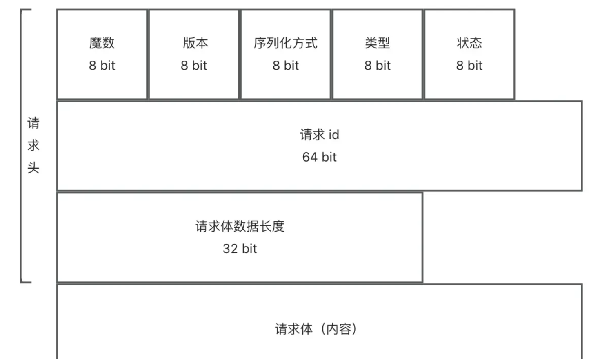
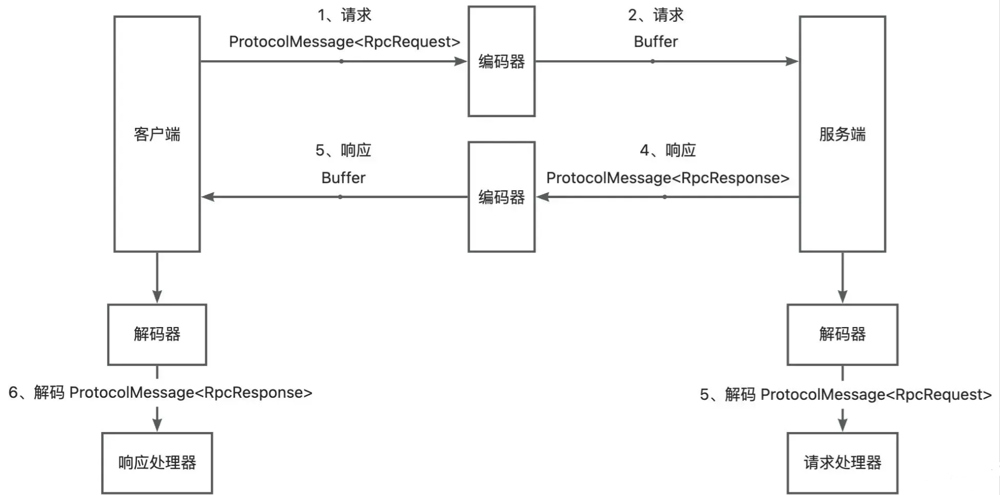

# kk-rpc
kk-rpc 框架

# etcd

- 安装 etcd ，参考 https://github.com/etcd-io/etcd/releases
  - 虚拟机重启后需要重新安装一下，因为 tmp 目录在 Linux 重启后会删除

```bash
ETCD_VER=v3.5.17
# Linux 查看变量
echo $ETCD_VER

# choose either URL
GOOGLE_URL=https://storage.googleapis.com/etcd
GITHUB_URL=https://github.com/etcd-io/etcd/releases/download
DOWNLOAD_URL=${GOOGLE_URL}

rm -f /tmp/etcd-${ETCD_VER}-linux-amd64.tar.gz
rm -rf /tmp/etcd-download-test && mkdir -p /tmp/etcd-download-test

curl -L ${DOWNLOAD_URL}/${ETCD_VER}/etcd-${ETCD_VER}-linux-amd64.tar.gz -o /tmp/etcd-${ETCD_VER}-linux-amd64.tar.gz
tar xzvf /tmp/etcd-${ETCD_VER}-linux-amd64.tar.gz -C /tmp/etcd-download-test --strip-components=1
rm -f /tmp/etcd-${ETCD_VER}-linux-amd64.tar.gz

/tmp/etcd-download-test/etcd --version
/tmp/etcd-download-test/etcdctl version
/tmp/etcd-download-test/etcdutl version

# start a local etcd server
/tmp/etcd-download-test/etcd

# write,read to etcd
/tmp/etcd-download-test/etcdctl --endpoints=localhost:2379 put foo bar
/tmp/etcd-download-test/etcdctl --endpoints=localhost:2379 get foo
```

```bash
# 开启服务器端口
firewall-cmd --zone=public --add-port=8889/tcp --permanent
# 重新加载防火墙
firewall-cmd --reload
netstat -ntulp |grep 8889

# 启动 etcd
/tmp/etcd-download-test/etcd --listen-client-urls http://0.0.0.0:2379 --advertise-client-urls http://0.0.0.0:2379 --listen-peer-urls http://0.0.0.0:2380

# 启动 etcdkeeper
/opt/etcdkeeper-v0.7.8/etcdkeeper -p 8889

# 后台启动
nohup /tmp/etcd-download-test/etcd --listen-client-urls http://0.0.0.0:2379 --advertise-client-urls http://0.0.0.0:2379 --listen-peer-urls http://0.0.0.0:2380 > /tmp/etcd.log 2>&1 &

nohup /opt/etcdkeeper-v0.7.8/etcdkeeper -p 8889 /opt/etcdkeeper-v0.7.8/etcdkeeper.log 2>&1 &

/tmp/etcd-download-test/etcdctl --endpoints=localhost:2379 put foo bar
```


# 自定义 rpc 传输协议

## 需求分析

- 前面实现自定义 rpc 框架是使用 Vert.x 的 HttpServer 作为服务提供者的服务器，代码实现比较简单，其底层网络传输使用的是 HTTP 协议
  - 但是HTTP 只是 RPC 框架网络传输的一种可选方式罢了
  - 一般情况下，RPC 框架会比较注重性能，而 HTTP 协议中的头部信息、请求响应格式较“重”，会影响网络传输性能
  - 所以，我们需要自己自定义一套 RPC 协议，比如利用 TCP 等传输层协议、自己定义请求响应结构，来实现性能更高、
    更灵活、更安全的 RPC 框架

## 设计方案

### RPC 协议核心部分

1. 自定义网络传输
2. 自定义消息结构

### 网络传输设计（tcp 协议）

- 网络传输设计的目标是: 选择一个能够高性能通信的**网络协议**和**传输方式**
- 需求分析中已经提到了，HTTP 协议的头信息是比较大的，会影响传输性能。但其实除了这点外，HTTP 本身属于无状态协议，这意味着每个 HTTP 请求都是独立的，每次请求/响应都要重新建立和关闭连接，也会影响性能
  - 考虑到这点，在 HTTP/1.1 中引入了持久连接(**Keep-Alive**)，允许在单个TCP 连接上发送多个 HTTP 请求和响应，避免了每次请求都要重新建立和关闭连接的开销
  - 虽然如此，HTTP 本身是应用层协议，我们现在设计的 RPC 协议也是应用层协议，性能肯定是不如底层(传输层)的 TCP协议要高的。所以我们想要追求更高的性能，还是选择使用 **TCP 协议**完成网络传输，有更多的自主设计空间

### 消息结构设计

- 参考：https://cn.dubbo.apache.org/zh-cn/overview/reference/protocols/tcp/

- 消息结构设计的目标是:用 **最少的** 空间传递 **需要的信息**

- 如何使用最少的空间呢?

  - 之前接触到的数据类型可能都是整型、长整型、浮点数类型等等这些类型其实都比较“重”，占用的字节数较多。
    - 比如整型要占用 `4 个字节 = 32 个 bit 位`
  - 我们在自定义消息结构时，想要节省空间，就要尽可能使用更轻量的类型，比如 byte 字节类型，只占用 `1个字节 = 8个bit 位`
    - 需要注意的是，java 中实现 bit 位运算拼接相对比较麻烦，所以权衡开发成本，我们设计消息结构时，尽量给每个数据凑到整个字节

- 消息内需要哪些信息呢?

  - 目标肯定是能够完成请求嘛，那可以参考 HTTP 请求方式，找到一些线索

  - 分析 HTTP 请求结构，我们能够得到 RPC 消息所需的信息:

    - **魔数**: 作用是安全校验，防止服务器处理了非框架发来的乱七八糟的消息(类似 HTTPS 的安全证书)
    - **版本号**: 保证请求和响应的一致性(类似 HTTP 协议有 1.0/2.0 等版本)
    - **序列化方式**: 来告诉服务端和客户端如何解析数据(类似 HTTP 的 Content-Type 内容类型)
    - **类型**: 标识是请求还是响应?或者是心跳检测等其他用途。(类似 HTTP 有请求头和响应头)
    - **状态**: 如果是响应，记录响应的结果(类似 HTTP 的 200 状态代码)
    - 此外，还需要有**请求 id**，唯一标识某个请求，因为 TCP 是双向通信的，需要有个唯一标识来追踪每个请求
    - 最后最重要的是，要发送 **body 内容数据**。我们暂时称它为 **请求体**，类似于之前 HTTP 请求中发送的 RpcRequest
      - 如果是 HTTP 这种协议，有专门的 `key/value` 结构，很容易找到完整的 body 数据。但基于 TCP 协议，想要获取到完整的 body 内容数据，就需要一些“小心思”了，因为 TCP 协议本身会存在**半包和粘包问题**，每次传输的数据可能是不完整的
      - 所以我们需要在消息头中新增一个字段 **请求体数据长度** ，保证能够完整地获取 body 内容信息

  - 所以消息结构设计如下图

    

  - 实际上，这些数据应该是紧凑的，请求头信息总长 17 个字节。也就是说，上述消息结构，本质上就是拼接在一起的字节数组。后续实现时，需要有 **消息编码器** 和 **消息解码器**

    - 编码器先 new 一个空的 Bufer 缓冲区，然后按照顺向缓冲区依次写入这些数据
    - 解码器在读取时也按照顺序依次读取，就能还原出编码前的数据

  - 通过这种约定的方式，我们就不用记录头信息了。比如 magic 魔数，不用存储“magic” 这个字符串，而是读取第一个字节(前 8 bit)就能获取到。Redis 底层很多数据结构也都是这种设计

  - 例如参考 doubbo 的协议设计

    

### 开发实现

#### 1、消息结构实现

1. 创建协议消息结构类

   ```java
   package com.lhk.kkrpc.protocol;
   
   import lombok.AllArgsConstructor;
   import lombok.Data;
   import lombok.NoArgsConstructor;
   
   /**
    * 协议消息结构
    */
   @Data
   @AllArgsConstructor
   @NoArgsConstructor
   public class ProtocolMessage<T> {
   
       /**
        * 消息头
        */
       private Header header;
   
       /**
        * 消息体（请求或响应对象）
        */
       private T body;
   
       /**
        * 协议消息头
        */
       @Data
       public static class Header {
   
           /**
            * 魔数，保证安全性
            */
           private byte magic;
   
           /**
            * 版本号
            */
           private byte version;
   
           /**
            * 序列化器
            */
           private byte serializer;
   
           /**
            * 消息类型（请求 / 响应）
            */
           private byte type;
   
           /**
            * 状态
            */
           private byte status;
   
           /**
            * 请求 id
            */
           private long requestId;
   
           /**
            * 消息体长度
            */
           private int bodyLength;
       }
   
   }
   ```

2. 新建协议常量类，记录和自定义协议有关的关键信息，比如消息头长度、魔数、版本号

   ```java
   package com.lhk.kkrpc.protocol;
   
   /**
    * 协议常量
    */
   public interface ProtocolConstant {
   
       /**
        * 消息头长度
        */
       int MESSAGE_HEADER_LENGTH = 17;
   
       /**
        * 协议魔数（16进制）
        */
       byte PROTOCOL_MAGIC = 0x1;
   
       /**
        * 协议版本号（16进制）
        */
       byte PROTOCOL_VERSION = 0x1;
   }
   ```

3. 新建消息字段的枚举类

   - **协议状态枚举**，暂时只定义**成功**、**请求失败**、**响应失败**三种枚举值:

     ```java
     package com.lhk.kkrpc.protocol;
     
     import lombok.Getter;
     
     /**
      * 协议消息的状态枚举
      */
     @Getter
     public enum ProtocolMessageStatusEnum {
     
         OK("ok", 20),
         BAD_REQUEST("badRequest", 40),
         BAD_RESPONSE("badResponse", 50);
     
         private final String text;
     
         private final int value;
     
         ProtocolMessageStatusEnum(String text, int value) {
             this.text = text;
             this.value = value;
         }
     
         /**
          * 根据 value 获取枚举
          *
          * @param value
          * @return
          */
         public static ProtocolMessageStatusEnum getEnumByValue(int value) {
             for (ProtocolMessageStatusEnum anEnum : ProtocolMessageStatusEnum.values()) {
                 if (anEnum.value == value) {
                     return anEnum;
                 }
             }
             return null;
         }
     }
     ```

   - 协议消息类型枚举，包括请求、响应、心跳、其他

     ```java
     package com.lhk.kkrpc.protocol;
     
     import lombok.Getter;
     
     /**
      * 协议消息的类型枚举
      */
     @Getter
     public enum ProtocolMessageTypeEnum {
     
         REQUEST(0),
         RESPONSE(1),
         HEART_BEAT(2),
         OTHERS(3);
     
         private final int key;
     
         ProtocolMessageTypeEnum(int key) {
             this.key = key;
         }
     
         /**
          * 根据 key 获取枚举
          *
          * @param key
          * @return
          */
         public static ProtocolMessageTypeEnum getEnumByKey(int key) {
             for (ProtocolMessageTypeEnum anEnum : ProtocolMessageTypeEnum.values()) {
                 if (anEnum.key == key) {
                     return anEnum;
                 }
             }
             return null;
         }
     }
     ```

   - 协议消息的序列化器枚举，与自定义 RPC 框架已支持的序列化器对应

     ```java
     package com.lhk.kkrpc.protocol;
     
     import cn.hutool.core.util.ObjectUtil;
     import lombok.Getter;
     
     import java.util.Arrays;
     import java.util.List;
     import java.util.stream.Collectors;
     
     /**
      * 协议消息的序列化器枚举
      */
     @Getter
     public enum ProtocolMessageSerializerEnum {
     
         JDK(0, "jdk"),
         JSON(1, "json"),
         KRYO(2, "kryo"),
         HESSIAN(3, "hessian");
     
         private final int key;
     
         private final String value;
     
         ProtocolMessageSerializerEnum(int key, String value) {
             this.key = key;
             this.value = value;
         }
     
         /**
          * 获取值列表
          *
          * @return
          */
         public static List<String> getValues() {
             return Arrays.stream(values()).map(item -> item.value).collect(Collectors.toList());
         }
     
         /**
          * 根据 key 获取枚举
          *
          * @param key
          * @return
          */
         public static ProtocolMessageSerializerEnum getEnumByKey(int key) {
             for (ProtocolMessageSerializerEnum anEnum : ProtocolMessageSerializerEnum.values()) {
                 if (anEnum.key == key) {
                     return anEnum;
                 }
             }
             return null;
         }
     
     
         /**
          * 根据 value 获取枚举
          *
          * @param value
          * @return
          */
         public static ProtocolMessageSerializerEnum getEnumByValue(String value) {
             if (ObjectUtil.isEmpty(value)) {
                 return null;
             }
             for (ProtocolMessageSerializerEnum anEnum : ProtocolMessageSerializerEnum.values()) {
                 if (anEnum.value.equals(value)) {
                     return anEnum;
                 }
             }
             return null;
         }
     }
     ```


#### 2、网络传输实现（基于 Vert.x 的 TCP 传输）

前面 RPC 框架使用了高性能的 Vert.x 作为网络传输服务器，之前用的是 **HttpServer**。同样，Vert.x 也支持 TCP 服务器，相比于 Netty 或者自己写 Socket 代码，更加简单易用

1. TCP 服务器实现

   新建 VertxTcpServer 类，跟之前写的 VertxHttpServer 类似，先创建 Vert.x 的服务器实例，然后定义处理请求的方
   法，比如回复“Hello, client!”，最后启动服务器

   ```java
   import com.lhk.kkrpc.server.HttpServer;
   import io.vertx.core.Vertx;
   import io.vertx.core.buffer.Buffer;
   import io.vertx.core.net.NetServer;
   
   public class VertxTcpServer implements HttpServer {
   
       private byte[] handleRequest(byte[] requestData) {
           // 在这里编写处理请求的逻辑，根据 requestData 构造响应数据并返回
           // 这里只是一个示例，实际逻辑需要根据具体的业务需求来实现
           System.out.println("Received request: " + new String(requestData));
           return "Hello, client!".getBytes();
       }
   
       @Override
       public void doStart(int port) {
           // 创建 Vert.x 实例
           Vertx vertx = Vertx.vertx();
   
           // 创建 TCP 服务器
           NetServer server = vertx.createNetServer();
   
           // 处理请求
           server.connectHandler(socket -> {
               // 处理连接
               socket.handler(buffer -> {
                   // 处理接收到的字节数组
                   byte[] requestData = buffer.getBytes();
                   // 在这里进行自定义的字节数组处理逻辑，比如解析请求、调用服务、构造响应等
                   byte[] responseData = handleRequest(requestData);
                   // 发送响应
                   socket.write(Buffer.buffer(responseData));
               });
           });
   
           // 启动 TCP 服务器并监听指定端口
           server.listen(port, result -> {
               if (result.succeeded()) {
                   System.out.println("TCP server started on port " + port);
               } else {
                   System.err.println("Failed to start TCP server: " + result.cause());
               }
           });
       }
   
       public static void main(String[] args) {
           new VertxTcpServer().doStart(8888);
       }
   }
   ```

   上述代码中的 `socket.write` 方法，就是在向连接到服务器的客户端发送数据。注意发送的数据格式为 `Buffer`，这是 Ver
   t.x 为我们提供的字节数组缓冲区实现

2. TCP 客户端实现

   新建 `vertxTcpclient` 类，先创建 Vert.x 的客户端实例，然后定义处理请求的方法，比如回复"Hello,server!”，并建立连接

   ```java
   import io.vertx.core.Vertx;
   
   public class VertxTcpClient {
   
       public void start() {
           // 创建 Vert.x 实例
           Vertx vertx = Vertx.vertx();
   
           vertx.createNetClient().connect(8888, "localhost", result -> {
               if (result.succeeded()) {
                   System.out.println("Connected to TCP server");
                   io.vertx.core.net.NetSocket socket = result.result();
                   // 发送数据
                   socket.write("Hello, server!");
                   // 接收响应
                   socket.handler(buffer -> {
                       System.out.println("Received response from server: " + buffer.toString());
                   });
               } else {
                   System.err.println("Failed to connect to TCP server");
               }
           });
       }
   
       public static void main(String[] args) {
           new VertxTcpClient().start();
       }
   }
   ```

3. 可以先运行上面的 main 方法进行测试，先启动服务器，再启动客户端，能够在控制台看到它们互相打招呼的输出

#### 3、编码/解码器实现

- 注意，Vert.x 的 TCP 服务器收发的消息是 Bufer 类型，不能直接写入一个对象。因此，我们需要编码器和解码器，将 Java 的消息对象和 Buffer 进行相互转换

- 使用 HTTP 请求和响应时，直接从请求 body 处理器中获取到 body 字节数组，再通过序列化(反序列化)得到 RpcRequest 或 RpcResponse 对象。使用 TCP 服务器后，只不过改为从 Bufer 中获取字节数组，然后编解码为 RpcReauest 或 RpcResponse 对象，其他的后续处理流程都是可复用的

- 流程如图所示

  


1. 首先实现消息编码器

   在 protocol 包下新建 `ProtocolMessageEncoder`类，核心流程是依次向 Buffer 缓冲区写入消息对象（`ProtocolMessage`）里的字段

   ```java
   
   
   import com.lhk.kkrpc.serializer.Serializer;
   import com.lhk.kkrpc.serializer.SerializerFactory;
   import io.vertx.core.buffer.Buffer;
   
   import java.io.IOException;
   
   public class ProtocolMessageEncoder {
   
       /**
        * 编码
        *
        * @param protocolMessage
        * @return
        * @throws IOException
        */
       public static Buffer encode(ProtocolMessage<?> protocolMessage) throws IOException {
           if (protocolMessage == null || protocolMessage.getHeader() == null) {
               return Buffer.buffer();
           }
           ProtocolMessage.Header header = protocolMessage.getHeader();
           // 依次向缓冲区写入字节
           Buffer buffer = Buffer.buffer();
           buffer.appendByte(header.getMagic());
           buffer.appendByte(header.getVersion());
           buffer.appendByte(header.getSerializer());
           buffer.appendByte(header.getType());
           buffer.appendByte(header.getStatus());
           buffer.appendLong(header.getRequestId());
           // 获取序列化器
           ProtocolMessageSerializerEnum serializerEnum = ProtocolMessageSerializerEnum.getEnumByKey(header.getSerializer());
           if (serializerEnum == null) {
               throw new RuntimeException("序列化协议不存在");
           }
           Serializer serializer = SerializerFactory.getInstance(serializerEnum.getValue());
           byte[] bodyBytes = serializer.serialize(protocolMessage.getBody());
           // 写入 body 长度和数据
           buffer.appendInt(bodyBytes.length);
           buffer.appendBytes(bodyBytes);
           return buffer;
       }
   }
   
   ```

2. 实现消息解码器

   在 protocol 包下新建 `ProtocolMessageDecoder` 类， 核心流程是依次从 Buffer 缓冲区的指定位置读取字段，构造出完整的

   消息对象（`ProtocolMessage`）

   ```java
   import com.lhk.kkrpc.model.RpcRequest;
   import com.lhk.kkrpc.model.RpcResponse;
   import com.lhk.kkrpc.serializer.Serializer;
   import com.lhk.kkrpc.serializer.SerializerFactory;
   import io.vertx.core.buffer.Buffer;
   
   import java.io.IOException;
   
   /**
    * 协议消息解码器
    */
   public class ProtocolMessageDecoder {
   
       /**
        * 解码
        *
        * @param buffer
        * @return
        * @throws IOException
        */
   
       public static ProtocolMessage<?> decode(Buffer buffer) throws IOException {
           // 分别从指定位置读出 Buffer
           ProtocolMessage.Header header = new ProtocolMessage.Header();
           byte magic = buffer.getByte(0);
           // 校验魔数
           if (magic != ProtocolConstant.PROTOCOL_MAGIC) {
               throw new RuntimeException("消息 magic 非法");
           }
           header.setMagic(magic);
           header.setVersion(buffer.getByte(1));
           header.setSerializer(buffer.getByte(2));
           header.setType(buffer.getByte(3));
           header.setStatus(buffer.getByte(4));
           header.setRequestId(buffer.getLong(5));
           header.setBodyLength(buffer.getInt(13));
           // 解决粘包问题，只读指定长度的数据
           byte[] bodyBytes = buffer.getBytes(17, 17 + header.getBodyLength());
           // 解析消息体
           ProtocolMessageSerializerEnum serializerEnum = ProtocolMessageSerializerEnum.getEnumByKey(header.getSerializer());
           if (serializerEnum == null) {
               throw new RuntimeException("序列化消息的协议不存在");
           }
           Serializer serializer = SerializerFactory.getInstance(serializerEnum.getValue());
           ProtocolMessageTypeEnum messageTypeEnum = ProtocolMessageTypeEnum.getEnumByKey(header.getType());
           if (messageTypeEnum == null) {
               throw new RuntimeException("序列化消息的类型不存在");
           }
           switch (messageTypeEnum) {
               case REQUEST:
                   RpcRequest request = serializer.deserialize(bodyBytes, RpcRequest.class);
                   return new ProtocolMessage<>(header, request);
               case RESPONSE:
                   RpcResponse response = serializer.deserialize(bodyBytes, RpcResponse.class);
                   return new ProtocolMessage<>(header, response);
               case HEART_BEAT:
               case OTHERS:
               default:
                   throw new RuntimeException("暂不支持该消息类型");
           }
       }
   }
   ```

3. 编写单元测试类，先编码再解码，以测试编码器和解码器的正确性

   ```java
   import cn.hutool.core.util.IdUtil;
   import com.lhk.kkrpc.constant.RpcConstant;
   import com.lhk.kkrpc.model.RpcRequest;
   import io.vertx.core.buffer.Buffer;
   import org.junit.Assert;
   import org.junit.Test;
   import java.io.IOException;
   
   public class ProtocolMessageTest {
   
       @Test
       public void testEncodeAndDecode() throws IOException {
           // 构造消息
           ProtocolMessage<RpcRequest> protocolMessage = new ProtocolMessage<>();
           ProtocolMessage.Header header = new ProtocolMessage.Header();
           header.setMagic(ProtocolConstant.PROTOCOL_MAGIC);
           header.setVersion(ProtocolConstant.PROTOCOL_VERSION);
           header.setSerializer((byte) ProtocolMessageSerializerEnum.JDK.getKey());
           header.setType((byte) ProtocolMessageTypeEnum.REQUEST.getKey());
           header.setStatus((byte) ProtocolMessageStatusEnum.OK.getValue());
           header.setRequestId(IdUtil.getSnowflakeNextId());
           header.setBodyLength(0);
           RpcRequest rpcRequest = new RpcRequest();
           rpcRequest.setServiceName("myService");
           rpcRequest.setMethodName("myMethod");
           rpcRequest.setServiceVersion(RpcConstant.DEFAULT_SERVICE_VERSION);
           rpcRequest.setParameterTypes(new Class[]{String.class});
           rpcRequest.setArgs(new Object[]{"aaa", "bbb"});
           protocolMessage.setHeader(header);
           protocolMessage.setBody(rpcRequest);
   
           Buffer encodeBuffer = ProtocolMessageEncoder.encode(protocolMessage);
           ProtocolMessage<?> message = ProtocolMessageDecoder.decode(encodeBuffer);
           Assert.assertNotNull(message);
       }
   }
   ```

#### 4、请求处理器实现（服务提供者端调用）

- 请求处理器的作用是接受请求，然后通过反射调用服务实现类

- 可以使用 netty 的 pipeline 组合多个 handler（比如编码 =>解码 =>请求/响应处理）

- 类似之前的 `HttpServerHandler`，开发一个 `TcpServerHandler`，用于处理请求。和 `HttpServerHandler` 的区别只是在获取请求、写入响应的方式上，需要调用上面开发好的编码器和解码器。

- 通过实现 Vert.x 提供的 `Handler<Netsocket>` 接口，可以定义 TCP 请求处理器

- 具体实现

  ```java
  package com.lhk.kkrpc.server.tcp;
  
  import com.lhk.kkrpc.model.RpcRequest;
  import com.lhk.kkrpc.model.RpcResponse;
  import com.lhk.kkrpc.protocol.ProtocolMessage;
  import com.lhk.kkrpc.protocol.ProtocolMessageDecoder;
  import com.lhk.kkrpc.protocol.ProtocolMessageEncoder;
  import com.lhk.kkrpc.protocol.ProtocolMessageTypeEnum;
  import com.lhk.kkrpc.registry.LocalRegistry;
  import io.vertx.core.Handler;
  import io.vertx.core.buffer.Buffer;
  import io.vertx.core.net.NetSocket;
  
  import java.io.IOException;
  import java.lang.reflect.Method;
  
  public class TcpServerHandler implements Handler<NetSocket> {
  
      @Override
      public void handle(NetSocket netSocket) {
          // 处理连接
          netSocket.handler(buffer -> {
              // 接受请求，解码
              ProtocolMessage<RpcRequest> protocolMessage;
              try {
                  protocolMessage = (ProtocolMessage<RpcRequest>) ProtocolMessageDecoder.decode(buffer);
              } catch (IOException e) {
                  throw new RuntimeException("协议消息解码错误");
              }
              RpcRequest rpcRequest = protocolMessage.getBody();
  
              // 处理请求
              // 构造响应结果对象
              RpcResponse rpcResponse = new RpcResponse();
              try {
                  // 获取要调用的服务实现类，通过反射调用
                  Class<?> implClass = LocalRegistry.get(rpcRequest.getServiceName());
                  Method method = implClass.getMethod(rpcRequest.getMethodName(), rpcRequest.getParameterTypes());
                  Object result = method.invoke(implClass.newInstance(), rpcRequest.getArgs());
                  // 封装返回结果
                  rpcResponse.setData(result);
                  rpcResponse.setDataType(method.getReturnType());
                  rpcResponse.setMessage("ok");
              } catch (Exception e) {
                  e.printStackTrace();
                  rpcResponse.setMessage(e.getMessage());
                  rpcResponse.setException(e);
              }
  
              // 发送响应，编码
              ProtocolMessage.Header header = protocolMessage.getHeader();
              header.setType((byte) ProtocolMessageTypeEnum.RESPONSE.getKey());
              ProtocolMessage<RpcResponse> responseProtocolMessage = new ProtocolMessage<>(header, rpcResponse);
              try {
                  Buffer encode = ProtocolMessageEncoder.encode(responseProtocolMessage);
                  netSocket.write(encode);
              } catch (IOException e) {
                  throw new RuntimeException("协议消息编码错误");
              }
          });
      }
  }
  ```

#### 5、请求发送实现（服务消费者端调用）

- 修改服务代理，将 http 协议发送请求改为 tcp 协议发送

  ```java
  import cn.hutool.core.collection.CollUtil;
  import cn.hutool.core.util.IdUtil;
  import com.lhk.kkrpc.RpcApplication;
  import com.lhk.kkrpc.config.RpcConfig;
  import com.lhk.kkrpc.constant.RpcConstant;
  import com.lhk.kkrpc.model.RpcRequest;
  import com.lhk.kkrpc.model.RpcResponse;
  import com.lhk.kkrpc.model.ServiceMetaInfo;
  import com.lhk.kkrpc.protocol.*;
  import com.lhk.kkrpc.registry.Registry;
  import com.lhk.kkrpc.registry.RegistryFactory;
  import com.lhk.kkrpc.serializer.Serializer;
  import com.lhk.kkrpc.serializer.SerializerFactory;
  import io.vertx.core.Vertx;
  import io.vertx.core.buffer.Buffer;
  import io.vertx.core.net.NetClient;
  import io.vertx.core.net.NetSocket;
  
  import java.io.IOException;
  import java.lang.reflect.InvocationHandler;
  import java.lang.reflect.Method;
  import java.util.List;
  import java.util.concurrent.CompletableFuture;
  
  /**
   * 服务代理（JDK 动态代理）
   */
  public class ServiceProxy implements InvocationHandler {
  
      /**
       * 调用代理
       *
       * @return
       * @throws Throwable
       */
      @Override
      public Object invoke(Object proxy, Method method, Object[] args) throws Throwable {
          // 构造请求
          String serviceName = method.getDeclaringClass().getName();
          RpcRequest rpcRequest = RpcRequest.builder()
                  .serviceName(serviceName)
                  .methodName(method.getName())
                  .parameterTypes(method.getParameterTypes())
                  .args(args)
                  .build();
          // 从注册中心获取服务提供者请求地址
          RpcConfig rpcConfig = RpcApplication.getRpcConfig();
          Registry registry = RegistryFactory.getInstance(rpcConfig.getRegistryConfig().getRegistry());
          ServiceMetaInfo serviceMetaInfo = new ServiceMetaInfo();
          serviceMetaInfo.setServiceName(serviceName);
          serviceMetaInfo.setServiceVersion(RpcConstant.DEFAULT_SERVICE_VERSION);
          List<ServiceMetaInfo> serviceMetaInfoList = registry.serviceDiscovery(serviceMetaInfo.getServiceKey());
          if (CollUtil.isEmpty(serviceMetaInfoList)) {
              throw new RuntimeException("暂无服务地址");
          }
  
          // todo 后续做负载均衡
          // 暂时先取第一个
          ServiceMetaInfo serviceMetaInfo = serviceMetaInfoList.get(0);
  
          // 发送 tcp 请求
          Vertx vertx = Vertx.vertx();
          NetClient netClient = vertx.createNetClient();
          // 由于 vertx 发送的是异步的 tcp 请求，所以需要使用 CompletableFuture 转异步为同步更方便获取请求结果
          CompletableFuture<RpcResponse> responseCompletableFuture = new CompletableFuture<>();
          netClient.connect(serviceMetaInfo.getServicePort(), serviceMetaInfo.getServiceHost(),
                  (connectResult) -> {
                      // 判断是否连接成功
                      if (connectResult.succeeded()) {
                          System.out.println("Connected to tcp server succeeded");
                          // 获取 netSocket 连接,用于发送数据
                          NetSocket netSocket = connectResult.result();
                          // 构造 tcp 请求消息
                          ProtocolMessage<RpcRequest> rpcRequesttProtocolMessage = new ProtocolMessage<>();
                          ProtocolMessage.Header header = new ProtocolMessage.Header();
                          header.setMagic(ProtocolConstant.PROTOCOL_MAGIC);
                          header.setVersion(ProtocolConstant.PROTOCOL_VERSION);
                          // 指定序列化器
                          header.setSerializer((byte) ProtocolMessageSerializerEnum.getEnumByValue(RpcApplication.getRpcConfig().getSerializer()).getKey());
                          header.setType((byte) ProtocolMessageTypeEnum.REQUEST.getKey());
                          header.setRequestId(IdUtil.getSnowflakeNextId());
                          rpcRequesttProtocolMessage.setHeader(header);
                          rpcRequesttProtocolMessage.setBody(rpcRequest);
                          //编码请求消息
                          try {
                              Buffer encodeBuffer = ProtocolMessageEncoder.encode(rpcRequesttProtocolMessage);
                              netSocket.write(encodeBuffer);
                          } catch (IOException e) {
                              throw new RuntimeException("tcp 请求发送失败：消息编码错误/n" + e);
                          }
                          // 接收响应消息
                          netSocket.handler(buffer -> {
                              try {
                                  ProtocolMessage<RpcResponse> rpcResponseProtocolMessage = (ProtocolMessage<RpcResponse>) ProtocolMessageDecoder.decode(buffer);
                                  // 响应完成的时候将数据保存在 CompletableFuture 中
                                  responseCompletableFuture.complete(rpcResponseProtocolMessage.getBody());
                              } catch (IOException e) {
                                  throw new RuntimeException("接收 tcp 响应失败：消息解码错误/n" + e);
                              }
                          });
                  }else {
                          System.out.println("Connected to tcp server failed");
                      }
              });
          // 阻塞，直到响应完成，才会继续执行获取数据
          RpcResponse rpcResponse = responseCompletableFuture.get();
          // 关闭连接并返回响应数据
          netClient.close();
          return rpcResponse.getData();
      }
  }
  ```

- 由于 Vert.x 提供的请求处理器是异步、反应式的，为了更方便地获取结果，可以使用 `completableFuture` **转异步为同步**

### 半包粘包问题

#### 1. 什么是半包粘包

- 半包粘包是 TCP 通信中常见的问题，其本质是由于 TCP 协议不保证消息边界导致的。通过在应用层设计明确的消息格式（如消息头、分隔符等），可以有效解决这一问题

  > 半包粘包的概念
  > 在计算机网络通信中，"半包粘包"是描述数据传输过程中的一种现象。为了更好地理解这一概念，可以先了解什么是粘包和拆包。
  >
  > 1. 粘包
  > 定义：当发送方连续发送多条消息时，接收方可能将这些消息合并成一条消息接收，这种现象称为粘包。
  > 原因：
  > TCP是基于字节流的协议，不关心应用层的消息边界。
  > 发送方可能连续发送多条消息，而接收方一次读取到了多条消息的内容。
  > 2. 拆包
  > 定义：当发送方的一条完整消息被分成了多段，接收方需要多次读取才能拼接成完整的消息，这种现象称为拆包。
  > 原因：
  > TCP协议栈根据MTU（最大传输单元）或网络拥塞情况对数据进行分片。
  > 接收方一次读取到的数据不足以构成一条完整的消息。
  > 3. 半包粘包
  > 定义：半包粘包是粘包和拆包的组合现象，即接收方读取到的数据既包含了多条消息的合并（粘包），又可能包含部分未完成的消息片段（拆包）。
  > 示例：
  > 假设发送方发送了两条消息 Message1 和 Message2。
  > 接收方可能读取到如下内容：
  > 第一次读取：Message1Par（Message1 的一部分，拆包）。
  > 第二次读取：t1Message2（Message1 的剩余部分 + Message2 的一部分，粘包）。
  >
  > 解决方案
  > 为了解决半包粘包问题，通常需要在应用层设计明确的消息边界或长度标识。以下是常见的解决方案：
  >
  > 
  >
  > 方法一：固定长度消息
  > 原理：每条消息的长度固定，接收方根据固定长度解析消息。
  > 优点：简单易实现。
  > 缺点：灵活性差，无法处理动态长度的消息。
  >
  > 
  >
  > 方法二：消息头携带长度
  > 原理：在每条消息前添加一个固定长度的消息头，消息头中包含消息体的长度信息。
  > 优点：灵活支持动态长度的消息。
  > 缺点：需要额外解析消息头。
  >
  > 
  >
  > 方法三：特殊分隔符
  > 原理：使用特定字符（如 \n 或其他不可见字符）作为消息的分隔符。
  > 优点：实现简单。
  > 缺点：如果消息内容中包含分隔符，可能导致解析错误。
  >
  > 
  >
  > 方法四：组合方案
  > 原理：结合多种方法，例如使用消息头+特殊分隔符，确保消息解析的准确性和灵活性。

#### 2. 演示半包粘包

- 修改 client 端代码，连续发送消息到 server 端

  ```java 
  import io.vertx.core.Vertx;
  
  public class VertxTcpClient {
      /**
       * 示例客户端
       */
      public void start() {
          // 创建 Vert.x 实例
          Vertx vertx = Vertx.vertx();
  
          vertx.createNetClient().connect(8888, "localhost", result -> {
              if (result.succeeded()) {
                  System.out.println("Connected to TCP server");
                  io.vertx.core.net.NetSocket socket = result.result();
                  // 发送数据，测试半包粘包
                  for (int i = 0; i < 10000; i++) {
                      socket.write("Hello, server!Hello, server!Hello, server!Hello, server!");
                  }
                  // 接收响应
                  socket.handler(buffer -> {
                      System.out.println("Received response from server: " + buffer.toString());
                  });
              } else {
                  System.err.println("Failed to connect to TCP server");
              }
          });
      }
  
      public static void main(String[] args) {
          new VertxTcpClient().start();
      }
  }
  ```

- 修改 server 端代码，输出粘包半包情况

  ```java
  package com.lhk.kkrpc.server.tcp;
  
  import com.lhk.kkrpc.server.HttpServer;
  import io.vertx.core.Vertx;
  import io.vertx.core.net.NetServer;
  
  public class VertxTcpServer implements HttpServer {
  
      /**
       * 示例请求处理逻辑
       * @param requestData
       * @return
       */
      private byte[] handleRequest(byte[] requestData) {
          // 在这里编写处理请求的逻辑，根据 requestData 构造响应数据并返回
          // 这里只是一个示例，实际逻辑需要根据具体的业务需求来实现
          // 演示半包粘包
          String correctMessage = "Hello, server!Hello, server!Hello, server!Hello, server!";
          int correctMessageLength = correctMessage.getBytes().length;
          System.out.println("正确的接收的数据，length:" + correctMessageLength);
          if (correctMessageLength < requestData.length){
              System.out.println("粘包，length = " + requestData.length);
          }
          if (correctMessageLength > requestData.length){
              System.out.println("半包，length = " + requestData.length);
          }
          if (correctMessageLength == requestData.length){
              System.out.println("Received request: " + new String(requestData));
          }
          return "Hello, client!".getBytes();
      }
  
      @Override
      public void doStart(int port) {
          // 创建 Vert.x 实例
          Vertx vertx = Vertx.vertx();
  
          // 创建 TCP 服务器
          NetServer server = vertx.createNetServer();
  
          // 请求处理
  //        server.connectHandler(new TcpServerHandler());
  
          // 示例处理请求
          server.connectHandler(socket -> {
              // 处理连接
              socket.handler(buffer -> {
                  // 处理接收到的字节数组
                  byte[] requestData = buffer.getBytes();
                  // 在这里进行自定义的字节数组处理逻辑，比如解析请求、调用服务、构造响应等
                  byte[] responseData = handleRequest(requestData);
                  // 发送响应
  //                socket.write(Buffer.buffer(responseData));
              });
          });
  
          // 启动 TCP 服务器并监听指定端口
          server.listen(port, result -> {
              if (result.succeeded()) {
                  System.out.println("TCP server started on port " + port);
              } else {
                  System.err.println("Failed to start TCP server: " + result.cause());
              }
          });
      }
  
  
      // 测试运行 tcp 服务器
      public static void main(String[] args) {
          new VertxTcpServer().doStart(8888);
      }
  }
  
  ```

#### 3. 如何解决半包粘包

- 解决**半包**的核心思路是：在消息头中设置请求体的长度，服务端接收时，判断每次消息的长度是否符合预期，不完整就
  不读，留到下一次接收到消息时再读取

  ```java
  if (buffer == null || buffer.length() == 0) {
      throw new RuntimeException("消息 buffer 为空");
  }
  if (buffer.getBytes().length < ProtocolConstant.MESSAGE_HEADER_LENGTH) {
      throw new RuntimeException("出现了半包问题");
  }
  ```

- 解决**粘包**的核心思路也是类似的：每次只读取指定长度的数据，超过长度的留着下一次接收到消息时再读取

  ```java
  // 解决粘包问题，只读指定长度的数据
  byte[] bodyBytes = buffer.getBytes(17, 17 + header.getBodyLength());
  ```

- 听上去简单，但自己实现起来还是比较麻烦的，要记录每次接收到的消息位置，维护字节数组缓存。

#### 4. Vert.x 解决半包粘包问题

- 在 Vert.x 框架中，可以使用内置的 `RecordParser` 完美解决半包粘包。它的作用是：保证下次读取到特定长度的字符

  ```java
  package com.lhk.kkrpc.server.tcp;
  
  import com.lhk.kkrpc.server.HttpServer;
  import io.vertx.core.Handler;
  import io.vertx.core.Vertx;
  import io.vertx.core.buffer.Buffer;
  import io.vertx.core.net.NetServer;
  import io.vertx.core.parsetools.RecordParser;
  
  public class VertxTcpServer implements HttpServer {
  
      @Override
      public void doStart(int port) {
          // 创建 Vert.x 实例
          Vertx vertx = Vertx.vertx();
  
          // 创建 TCP 服务器
          NetServer server = vertx.createNetServer();
  
          // 请求处理
  //        server.connectHandler(new TcpServerHandler());
  
          // 示例处理请求
          server.connectHandler(socket -> {
  
              String correctMessage = "Hello, server!Hello, server!Hello, server!Hello, server!";
              int correctMessageLength = correctMessage.getBytes().length;
  
              // 构造 RecordParser, 为 Parser 指定每次读取固定值长度的内容
              RecordParser recordParser = RecordParser.newFixed(correctMessageLength);
              recordParser.setOutput(new Handler<Buffer>() {
                  @Override
                  public void handle(Buffer buffer) {
                      // 处理接收到的字节数组
                      byte[] requestData = buffer.getBytes();
                      String requestString = new String(requestData);
                      System.out.println("correct message length: " + correctMessageLength);
                      System.out.println("Received message length: " + requestData.length);
                      System.out.println("Received message: " + requestString);
                      if (requestString.equals(correctMessage)){
                          System.out.println("Received correct message");
                      }else {
                          System.out.println("Received incorrect message");
                      }
                  }
              });
  
              // 处理连接
              socket.handler(recordParser);
          });
  
          // 启动 TCP 服务器并监听指定端口
          server.listen(port, result -> {
              if (result.succeeded()) {
                  System.out.println("TCP server started on port " + port);
              } else {
                  System.err.println("Failed to start TCP server: " + result.cause());
              }
          });
      }
  
  
      // 测试运行 tcp 服务器
      public static void main(String[] args) {
          new VertxTcpServer().doStart(8888);
      }
  }
  
  ```

  - `RecordParser.newFixed(correctMessageLength);` 这段代码为 Parser 指定每次读取固定值长度的内容

- 上面的示例发送的是固定长度的消息，因此每次都只要读取固定长度的消息即可。但是实际运用中，消息体的长度是不固定的，所以要通过调整 `RecordParser` 的固定长度（变长）来解决

  - 思路：将读取完整的消息拆分为2次：
    1.先完整**读取请求头信息**，由于请求头信息长度是固定的，可以使用 `RecordParser` 保证每次都完整读取
    2.再根据请求头长度信息更改 `RecordParser` 的固定长度，保证完整读取到请求体信息

  ```java
  package com.lhk.kkrpc.server.tcp;
  
  import io.vertx.core.Vertx;
  import io.vertx.core.buffer.Buffer;
  
  public class VertxTcpClient {
      /**
       * 示例客户端
       */
      public void start() {
          // 创建 Vert.x 实例
          Vertx vertx = Vertx.vertx();
  
          vertx.createNetClient().connect(8888, "localhost", result -> {
              if (result.succeeded()) {
                  System.out.println("Connected to TCP server");
                  io.vertx.core.net.NetSocket socket = result.result();
                  // 发送数据，测试半包粘包(不固定长度的消息体)
                  for (int i = 0; i < 10000; i++) {
                      String str = "Hello, server!Hello, server!Hello, server!Hello, server!"+ i;
                      // 发送数据
                      Buffer buffer = Buffer.buffer();
                      //模拟 header，8个字节
                      buffer.appendInt(0);  // 4个字节
                      buffer.appendInt(str.getBytes().length); // 4个字节
                      buffer.appendBytes(str.getBytes());
                      socket.write(buffer);
                  }
                  // 接收响应
                  socket.handler(buffer -> {
                      System.out.println("Received response from server: " + buffer.toString());
                  });
              } else {
                  System.err.println("Failed to connect to TCP server");
              }
          });
      }
  
      public static void main(String[] args) {
          new VertxTcpClient().start();
      }
  }
  ```

  ```java
  package com.lhk.kkrpc.server.tcp;
  
  import com.lhk.kkrpc.server.HttpServer;
  import io.vertx.core.Handler;
  import io.vertx.core.Vertx;
  import io.vertx.core.buffer.Buffer;
  import io.vertx.core.net.NetServer;
  import io.vertx.core.parsetools.RecordParser;
  
  public class VertxTcpServer implements HttpServer {
  
      @Override
      public void doStart(int port) {
          // 创建 Vert.x 实例
          Vertx vertx = Vertx.vertx();
  
          // 创建 TCP 服务器
          NetServer server = vertx.createNetServer();
  
          // 请求处理
  //        server.connectHandler(new TcpServerHandler());
  
          // 示例处理请求
          server.connectHandler(socket -> {
  
              // 构造 RecordParser, 为 Parser 指定每次读取固定值长度的内容，8个字节是读取 header 的信息
              RecordParser recordParser = RecordParser.newFixed(8);
              recordParser.setOutput(new Handler<Buffer>() {
                  // 初始化消息体的容量
                  int bodySize = -1;
                  // 用于接收一次完整的读取（头 + 体）
                  Buffer resultBuffer = Buffer.buffer();
                  @Override
                  public void handle(Buffer buffer) {
                      if (bodySize == -1){
                          // 读取消息体的长度
                          bodySize = buffer.getInt(4);
                          // 读取消息体的内容
                          recordParser.fixedSizeMode(bodySize);
                          // 将消息头添加到 resultBuffer 中
                          resultBuffer.appendBuffer(buffer);
                      }else{
                          // 将消息体添加到 resultBuffer 中
                          resultBuffer.appendBuffer(buffer);
                          System.out.println("resultBuffer:" + new String(buffer.getBytes()));
                          // 重置一轮，为下次读取消息头做准备
                          recordParser.fixedSizeMode(8);
                          bodySize = -1;
                          resultBuffer = Buffer.buffer();
                      }
                  }
              });
  
              // 处理连接
              socket.handler(recordParser);
          });
  
          // 启动 TCP 服务器并监听指定端口
          server.listen(port, result -> {
              if (result.succeeded()) {
                  System.out.println("TCP server started on port " + port);
              } else {
                  System.err.println("Failed to start TCP server: " + result.cause());
              }
          });
      }
  
  
      // 测试运行 tcp 服务器
      public static void main(String[] args) {
          new VertxTcpServer().doStart(8888);
      }
  }
  ```

#### 5. 封装半包粘包处理器

- 上面的代码只是做了测试，并未对自定义 rpc 框架中的半包粘包问题进行处理
- 且解决半包粘包问题还是有一定的代码量的，由于 `ServiceProxy`(消费者）和请求 `Handler` (提供者）都
  需要接受 `Buffer`，所以都需要半包粘包问题处理，那就需要对代码进行封装复用了
  - 可以使用设计模式中的**装饰者模式**，使用 `RecordParser` 对原有的 `Buffer` 处理器的能力进行增强
  - 装饰者模式可以简单理解为给对象穿装备，增强对象的能力

```java
package com.lhk.kkrpc.server.tcp;

import com.lhk.kkrpc.protocol.ProtocolConstant;
import io.vertx.core.Handler;
import io.vertx.core.buffer.Buffer;
import io.vertx.core.parsetools.RecordParser;

/**
 * 装饰者模式（使用 recordParser 对原有的 buffer 处理能力进行增强）
 */
public class TcpBufferHandlerWrapper implements Handler<Buffer> {

    private final RecordParser recordParser;

    public TcpBufferHandlerWrapper(Handler<Buffer> bufferHandler) {
        recordParser = initRecordParser(bufferHandler);
    }

    @Override
    public void handle(Buffer buffer) {
        recordParser.handle(buffer);
    }

    /**
     * 构造 RecordParser
     * @param bufferHandler
     * @return RecordParser
     */
    private RecordParser initRecordParser(Handler<Buffer> bufferHandler) {
        // 构造 parser
        RecordParser parser = RecordParser.newFixed(ProtocolConstant.MESSAGE_HEADER_LENGTH);

        parser.setOutput(new Handler<Buffer>() {
            // 初始化
            int size = -1;
            // 一次完整的读取（头 + 体）
            Buffer resultBuffer = Buffer.buffer();

            @Override
            public void handle(Buffer buffer) {
                if (-1 == size) {
                    // 读取消息体长度
                    size = buffer.getInt(13);
                    parser.fixedSizeMode(size);
                    // 写入头信息到结果
                    resultBuffer.appendBuffer(buffer);
                } else {
                    // 写入体信息到结果
                    resultBuffer.appendBuffer(buffer);
                    // 已拼接为完整 Buffer，执行处理
                    bufferHandler.handle(resultBuffer);
                    // 重置一轮
                    parser.fixedSizeMode(ProtocolConstant.MESSAGE_HEADER_LENGTH);
                    size = -1;
                    resultBuffer = Buffer.buffer();
                }
            }
        });

        return parser;
    }
}
```

#### 6. 调整业务代码

1. 修改 tcp 请求处理器

   - 使用 `TcpBufferHandlerWrapper` 来封装之前处理请求的代码，请求逻辑不用变
   - 其实就是使用一个 `Wrapper` 对象包装了之前的代码，就解决了半包粘包，这就是**装饰者模式**的妙用！

   ```java
   package com.lhk.kkrpc.server.tcp;
   
   import com.lhk.kkrpc.model.RpcRequest;
   import com.lhk.kkrpc.model.RpcResponse;
   import com.lhk.kkrpc.protocol.ProtocolMessage;
   import com.lhk.kkrpc.protocol.ProtocolMessageDecoder;
   import com.lhk.kkrpc.protocol.ProtocolMessageEncoder;
   import com.lhk.kkrpc.protocol.ProtocolMessageTypeEnum;
   import com.lhk.kkrpc.registry.LocalRegistry;
   import io.vertx.core.Handler;
   import io.vertx.core.buffer.Buffer;
   import io.vertx.core.net.NetSocket;
   
   import java.io.IOException;
   import java.lang.reflect.Method;
   
   /**
    * TCP 请求处理器处理器（服务端调用）
    */
   public class TcpServerHandler implements Handler<NetSocket> {
   
       @Override
       public void handle(NetSocket netSocket) {
           // BufferHandlerWrapper 对原生 Handler<Buffer> 进行了增强，用于处理粘包拆包问题
           TcpBufferHandlerWrapper tcpBufferHandlerWrapper = new TcpBufferHandlerWrapper(buffer -> {
               // 接受请求，解码
               ProtocolMessage<RpcRequest> protocolMessage;
               try {
                   protocolMessage = (ProtocolMessage<RpcRequest>) ProtocolMessageDecoder.decode(buffer);
               } catch (IOException e) {
                   throw new RuntimeException("协议消息解码错误");
               }
               RpcRequest rpcRequest = protocolMessage.getBody();
   
               // 处理请求
               // 构造响应结果对象
               RpcResponse rpcResponse = new RpcResponse();
               try {
                   // 获取要调用的服务实现类，通过反射调用
                   Class<?> implClass = LocalRegistry.get(rpcRequest.getServiceName());
                   Method method = implClass.getMethod(rpcRequest.getMethodName(), rpcRequest.getParameterTypes());
                   Object result = method.invoke(implClass.newInstance(), rpcRequest.getArgs());
                   // 封装返回结果
                   rpcResponse.setData(result);
                   rpcResponse.setDataType(method.getReturnType());
                   rpcResponse.setMessage("ok");
               } catch (Exception e) {
                   e.printStackTrace();
                   rpcResponse.setMessage(e.getMessage());
                   rpcResponse.setException(e);
               }
   
               // 发送响应，编码
               ProtocolMessage.Header header = protocolMessage.getHeader();
               header.setType((byte) ProtocolMessageTypeEnum.RESPONSE.getKey());
               ProtocolMessage<RpcResponse> responseProtocolMessage = new ProtocolMessage<>(header, rpcResponse);
               try {
                   Buffer encode = ProtocolMessageEncoder.encode(responseProtocolMessage);
                   netSocket.write(encode);
               } catch (IOException e) {
                   throw new RuntimeException("协议消息编码错误");
               }
           });
           // 处理连接
           netSocket.handler(tcpBufferHandlerWrapper);
       }
   }
   ```

2. 修改客户端发送请求后接受到响应的代码

   - 把`ServiceProxy`中所有的请求响应逻辑提取出来，封装为单独的 `VertxTcpClient` 类，并使用 `TcpBufferHandlerWrapper `对响应的代码进行封装，解决响应的半包粘包问题

     ```java
     package com.lhk.kkrpc.server.tcp;
     
     import cn.hutool.core.util.IdUtil;
     import com.lhk.kkrpc.RpcApplication;
     import com.lhk.kkrpc.model.RpcRequest;
     import com.lhk.kkrpc.model.RpcResponse;
     import com.lhk.kkrpc.model.ServiceMetaInfo;
     import com.lhk.kkrpc.protocol.*;
     import io.vertx.core.Vertx;
     import io.vertx.core.buffer.Buffer;
     import io.vertx.core.net.NetClient;
     import io.vertx.core.net.NetSocket;
     
     import java.io.IOException;
     import java.util.concurrent.CompletableFuture;
     import java.util.concurrent.ExecutionException;
     
     public class VertxTcpClient {
         /**
          * rpc 框架用于发送 tcp 请求的客户端
          */
         public static RpcResponse doRequest(RpcRequest rpcRequest, ServiceMetaInfo serviceMetaInfo) throws ExecutionException, InterruptedException {
             // 发送 tcp 请求
             Vertx vertx = Vertx.vertx();
             NetClient netClient = vertx.createNetClient();
             // 由于 vertx 发送的是异步的 tcp 请求，所以需要使用 CompletableFuture 转异步为同步更方便获取请求结果
             CompletableFuture<RpcResponse> responseCompletableFuture = new CompletableFuture<>();
             netClient.connect(serviceMetaInfo.getServicePort(), serviceMetaInfo.getServiceHost(),
                     (connectResult) -> {
                         // 判断是否连接成功
                         if (connectResult.succeeded()) {
                             System.out.println("Connected to tcp server succeeded");
                             // 获取 netSocket 连接,用于发送数据
                             NetSocket netSocket = connectResult.result();
                             // 构造 tcp 请求消息
                             ProtocolMessage<RpcRequest> rpcRequesttProtocolMessage = new ProtocolMessage<>();
                             ProtocolMessage.Header header = new ProtocolMessage.Header();
                             header.setMagic(ProtocolConstant.PROTOCOL_MAGIC);
                             header.setVersion(ProtocolConstant.PROTOCOL_VERSION);
                             // 指定序列化器
                             header.setSerializer((byte) ProtocolMessageSerializerEnum.getEnumByValue(RpcApplication.getRpcConfig().getSerializer()).getKey());
                             header.setType((byte) ProtocolMessageTypeEnum.REQUEST.getKey());
                             header.setRequestId(IdUtil.getSnowflakeNextId());
                             rpcRequesttProtocolMessage.setHeader(header);
                             rpcRequesttProtocolMessage.setBody(rpcRequest);
                             //编码请求消息
                             try {
                                 Buffer encodeBuffer = ProtocolMessageEncoder.encode(rpcRequesttProtocolMessage);
                                 netSocket.write(encodeBuffer);
                             } catch (IOException e) {
                                 throw new RuntimeException("tcp 请求发送失败：消息编码错误/n" + e);
                             }
                             // 接收响应消息，使用 TcpBufferHandlerWrapper 对响应的代码进行封装，解决响应的半包粘包问题
                             TcpBufferHandlerWrapper tcpBufferHandlerWrapper = new TcpBufferHandlerWrapper(buffer -> {
                                 try {
                                     try {
                                         ProtocolMessage<RpcResponse> rpcResponseProtocolMessage = (ProtocolMessage<RpcResponse>) ProtocolMessageDecoder.decode(buffer);
                                         // 响应完成的时候将数据保存在 CompletableFuture 中
                                         responseCompletableFuture.complete(rpcResponseProtocolMessage.getBody());
                                     } catch (IOException e) {
                                         throw new RuntimeException("接收 tcp 响应失败：消息解码错误/n" + e);
                                     }
                                 }
                             });
                             netSocket.handler(tcpBufferHandlerWrapper);
                         }else {
                             System.out.println("Connected to tcp server failed");
                         }
                     });
             // 阻塞，直到响应完成，才会继续执行获取数据
             RpcResponse rpcResponse = responseCompletableFuture.get();
             // 关闭连接并返回响应数据
             netClient.close();
             return rpcResponse;
         }
     }
     ```

   - 调整 `ServiceProxy` 类的代码

     ```java
     package com.lhk.kkrpc.proxy;
     
     import cn.hutool.core.collection.CollUtil;
     import com.lhk.kkrpc.RpcApplication;
     import com.lhk.kkrpc.config.RpcConfig;
     import com.lhk.kkrpc.constant.RpcConstant;
     import com.lhk.kkrpc.model.RpcRequest;
     import com.lhk.kkrpc.model.RpcResponse;
     import com.lhk.kkrpc.model.ServiceMetaInfo;
     import com.lhk.kkrpc.registry.Registry;
     import com.lhk.kkrpc.registry.RegistryFactory;
     import com.lhk.kkrpc.server.tcp.VertxTcpClient;
     
     import java.lang.reflect.InvocationHandler;
     import java.lang.reflect.Method;
     import java.util.List;
     
     /**
      * 服务代理（JDK 动态代理）（客户端发送请求时对请求进行处理后再发送）
      */
     public class ServiceProxy implements InvocationHandler {
     
         /**
          * 调用代理发送请求
          *
          * @return
          * @throws Throwable
          */
         @Override
         public Object invoke(Object proxy, Method method, Object[] args) {
             // 构造请求
             String serviceName = method.getDeclaringClass().getName();
             RpcRequest rpcRequest = RpcRequest.builder()
                     .serviceName(serviceName)
                     .methodName(method.getName())
                     .parameterTypes(method.getParameterTypes())
                     .args(args)
                     .build();
             try {
                 // 从注册中心获取服务提供者请求地址
                 RpcConfig rpcConfig = RpcApplication.getRpcConfig();
                 Registry registry = RegistryFactory.getInstance(rpcConfig.getRegistryConfig().getRegistry());
                 ServiceMetaInfo serviceMetaInfo = new ServiceMetaInfo();
                 serviceMetaInfo.setServiceName(serviceName);
                 serviceMetaInfo.setServiceVersion(RpcConstant.DEFAULT_SERVICE_VERSION);
                 List<ServiceMetaInfo> serviceMetaInfoList = registry.serviceDiscovery(serviceMetaInfo.getServiceKey());
                 if (CollUtil.isEmpty(serviceMetaInfoList)) {
                     throw new RuntimeException("暂无服务地址");
                 }
                 // todo 后续做负载均衡
                 // 暂时先取第一个
                 ServiceMetaInfo selectedServiceMetaInfo = serviceMetaInfoList.get(0);
                 // 发送 tcp 请求
                 RpcResponse rpcResponse = VertxTcpClient.doRequest(rpcRequest, selectedServiceMetaInfo);
                 return rpcResponse.getData();
             }catch (Exception e){
                 throw new RuntimeException("rpc 服务调用失败");
             }
         }
     }
     ```

3. 修改完毕后运行 `ProviderExample` 和 `ConsumerExample` 进行测试


## 负载均衡

- 目前这个 rpc 框架实现了服务消费者从 etcd 注册中心获取服务提供者注册的信息，当然同一个服务可能会有多个服务提供者，但是目前我们消费者始终读取了第一个服务提供者节点发起调用，不仅会增大单个节点的压力，而且没有利用好其他节点的资源。
- 因此我们完全可以从服务提供者节点中，选择一个服务提供者发起请求，而不是每次都请求同一个服务提供者，这个操作就叫做 **负载均衡**。

### 什么是负载均衡

- 何为**负载**?可以把负载理解为要处理的工作和压力，比如网络请求、事务、数据处理任务等
- 何为**均衡**?把工作和压力平均地分配给多个工作者，从而分摊每个工作者的压力，保证大家正常工作
- 所以，负载均衡是一种用来**分配网络或计算负载到多个资源上**的技术。它的目的是确保每个资源都能够有效地处理负载、增加系统的并发量、避免某些资源过载而导致性能下降或服务不可用的情况
- 常用的负载均衡实现技术有 Nginx(七层负载均衡)、LVS(四层负载均衡)等


#### 常见的负载均衡算法

#### 1. 轮询

- 轮询(Round Robin): 按照循环的顺序将请求分配给每个服务器，适用于各服务器性能相近的情况

#### 2. 随机

- 随机(Random): 随机选择一个服务器来处理请求，适用于服务器性能相近且负载均匀的情况

#### 3. 加权轮询

- 3)加权轮询(Weighted Round Robin): 适用于服务器性能不均的情况。根据服务器的性能或权重分配请求，性能更好的服务器会获得更多的请求

#### 4. 加权随机

- 加权随机(Weighted Random): 根据服务器的权重随机选择一个服务器处理请求，适用于服务器性能不均的情况

#### 5. 最小连接数

- 最小连接数(Least Connections): 选择当前连接数最少的服务器来处理请求，适用于长连接场景

#### 6. ip hash

- IP Hash: 根据客户端 IP 地址的哈希值选择服务器处理请求，确保同一客户端的请求始终被分配到同一台服务器上，适用于需要保持会话一致性的场景，当然，也可以根据请求中的其他参数进行 Hash，比如根据请求接口的地址路由到不同的服务器节点

#### 一致性 hash

- 一致性哈希(Consistent Hashing)是一种经典的哈希算法，用于**将请求分配到多个节点或服务器上**，所以非常适用于负载均衡。
  - 它的核心思想是将整个哈希值空间划分成一个环状结构，每个节点或服务器在环上占据一个位置，每个请求根据其哈希值映射到环上的一个点，然后顺时针寻找第一个大于或等于该哈希值的节点，将请求路由到该节点上
- 一致性哈希还解决了 **节点下线** 和 **倾斜问题**
  - **节点下线**: 当某个节点下线时，该节点上的负载（请求）会被平均分摊到其他节点上，而不会影响到整个系统的稳定性，因为只有该节点的部分请求会受到影响
    - 如果是轮询取模算法，只要节点数变了，很有可能大多数服务器处理的请求都要发生节点的变化，对系统的影响巨大
  - **倾斜问题**: 通过虚拟节点的引入，将每个物理节点映射到多个虚拟节点上，使得节点在哈希环上的分布更加均匀，减少了节点间的负载差异。

### 开发实现

### 一、多种负载均衡器的实现

- 对于负载均衡器的实现，可以参考 Nginx 的负载均衡器的实现

#### 1. 通用接口编写

- 建立 `loadbalancer` 包，编写一个负载均衡器的通用接口
  - 提供一个`select()` 选择服务方法，接受请求参数和可用服务列表，可以根据这些信息进行节点的选择

  ```java
  package com.lhk.kkrpc.loadbalancer;
  
  import com.lhk.kkrpc.model.ServiceMetaInfo;
  
  import java.util.List;
  import java.util.Map;
  
  /**
   * 负载均衡器（消费端使用）
   */
  public interface LoadBalancer {
  
      /**
       * 选择服务调用
       *
       * @param requestParams       请求参数
       * @param serviceMetaInfoList 可用服务列表
       * @return
       */
      ServiceMetaInfo select(Map<String, Object> requestParams, List<ServiceMetaInfo> serviceMetaInfoList);
  }
  ```

  

#### 2. 轮询负载均衡器的实现

- 使用 JUC 包的 `AtomicInteger` 实现原子计数器，防止并发冲突问题

  ```java
  package com.lhk.kkrpc.loadbalancer;
  
  import com.lhk.kkrpc.model.ServiceMetaInfo;
  
  import java.util.List;
  import java.util.Map;
  import java.util.concurrent.atomic.AtomicInteger;
  
  /**
   * 轮询负载均衡器
   */
  public class RoundRobinLoadBalancer implements LoadBalancer {
  
      /**
       * 当前轮询的下标
       * 使用 JUC 包的 AtomicInteger 实现原子计数器，防止并发冲突问题
       */
      private final AtomicInteger currentIndex = new AtomicInteger(0);
  
      @Override
      public ServiceMetaInfo select(Map<String, Object> requestParams, List<ServiceMetaInfo> serviceMetaInfoList) {
          if (serviceMetaInfoList.isEmpty()) {
              return null;
          }
          // 只有一个服务，无需轮询
          int size = serviceMetaInfoList.size();
          if (size == 1) {
              return serviceMetaInfoList.get(0);
          }
          // 取模算法轮询
          int index = currentIndex.getAndIncrement() % size; // 加一取模
          return serviceMetaInfoList.get(index);
      }
  }
  ```

#### 3. 随机负载均衡器的实现

- 使用 Java 自带的 Random 类实现随机选取即可

  ```java
  package com.lhk.kkrpc.loadbalancer;
  
  import com.lhk.kkrpc.model.ServiceMetaInfo;
  
  import java.util.List;
  import java.util.Map;
  import java.util.Random;
  
  /**
   * 随机负载均衡器
   */
  public class RandomLoadBalancer implements LoadBalancer {
  
      private final Random random = new Random();
  
      @Override
      public ServiceMetaInfo select(Map<String, Object> requestParams, List<ServiceMetaInfo> serviceMetaInfoList) {
          int size = serviceMetaInfoList.size();
          if (size == 0) {
              return null;
          }
          // 只有 1 个服务，不用随机
          if (size == 1) {
              return serviceMetaInfoList.get(0);
          }
          return serviceMetaInfoList.get(random.nextInt(size));
      }
  }
  ```

#### 4. 一致性 hash 负载均衡器的实现

- 可以使用 `TreeMap` 实现有序的一致性 Hash 环，该数据结构提供了 `ceilingEntry()` 和 `firstEntry()` 两个方法，便于获取符合算法要求的节点

  ```java
  package com.lhk.kkrpc.loadbalancer;
  
  import com.lhk.kkrpc.model.ServiceMetaInfo;
  
  import java.util.List;
  import java.util.Map;
  import java.util.TreeMap;
  
  /**
   * 一致性 hash 负载均衡器
   */
  public class ConsistentHashLoadBalancer implements LoadBalancer {
  
      /**
       * 一致性 hash 环，存放虚拟节点
       * TreeMap 保证节点的有序性，会根据节点的 hash 值进行排序
       */
      private final TreeMap<Integer, ServiceMetaInfo> virtualNodes= new TreeMap<>();
  
      /**
       * 单个节点的虚拟节点数量，默认 100
       */
      private final int VIRTUAL_NODE_COUNT = 100;
  
      @Override
      public ServiceMetaInfo select(Map<String, Object> requestParams, List<ServiceMetaInfo> serviceMetaInfoList) {
          if (serviceMetaInfoList.isEmpty()) {
              return null;
          }
  
          // 构建一致性 hash 环
          for (ServiceMetaInfo serviceMetaInfo : serviceMetaInfoList) {
              for (int i = 0; i < VIRTUAL_NODE_COUNT; i++) {
                  Integer virtualNodeHash = getHash(serviceMetaInfo.getServiceKey() + "#" + i);
                  virtualNodes.put(virtualNodeHash, serviceMetaInfo);
              }
          }
  
          // 根据请求参数的 hash 值，在虚拟节点的 hash 值范围内进行查找，找到对应的虚拟节点，返回对应的真实节点
          Integer requestHash = getHash(requestParams);
          // 选择最接近且大于等于调用请求 hash 值的虚拟节点
          Map.Entry<Integer, ServiceMetaInfo> entry = virtualNodes.ceilingEntry(requestHash);
          if (entry == null){
              // 如果没有找到，则选择第一个虚拟节点
              return virtualNodes.firstEntry().getValue();
          }
          return entry.getValue();
      }
  
      /**
       * 计算 key 的 hash 值
       * @param key
       * @return
       */
      private Integer getHash(Object key) {
          // 可以实现更好的哈希算法
          return key.hashCode();
      }
  }
  
  ```

  - 注意：每次调用负载均衡器时，都会重新构造 Hash 环，这是为了能够即时处理节点的变化，重新分配下线节点的请求


### 二、 实现支持配置和扩展负载均衡器（工厂模式 + SPI）

- 一个成熟的 RPC 框架可能会**支持多个负载均衡器**，像序列化器和注册中心一样，能够让开发者能够填写配置来指定负载均衡器，并且支持自定义负载均衡器，让框架更易用、更利于扩展
  - 要实现这点，开发方式和序列化器、注册中心都是一样的，都可以使用**工厂模式**创建对象、使用 **SPI 机制**动态加载自定义的注册中心

#### 1. 负载均衡器常量

- 列举出框架支持的所有负载均衡器键名

  ```java
  package com.lhk.kkrpc.loadbalancer;
  
  /**
   * 负载均衡器键名常量
   */
  public interface LoadBalancerKeys {
  
      /**
       * 轮询
       */
      String ROUND_ROBIN = "roundRobin";
  
      /**
       * 随机
       */
      String RANDOM = "random";
  
      /**
       * 一致性哈希
       */
      String CONSISTENT_HASH = "consistentHash";
  
  }
  ```


#### 2. 使用工厂模式，实现根据 key 从 SPI 获取指定负载均衡器对象实例

```java
package com.lhk.kkrpc.loadbalancer;

import com.lhk.kkrpc.spi.SpiLoader;

/**
 * 负载均衡器工厂（工厂模式，用于获取负载均衡器对象）
 */
public class LoadBalancerFactory {

    static {
        SpiLoader.load(LoadBalancer.class);
    }

    /**
     * 默认负载均衡器
     */
    private static final LoadBalancer DEFAULT_LOAD_BALANCER = new RoundRobinLoadBalancer();

    /**
     * 获取实例
     *
     * @param key
     * @return
     */
    public static LoadBalancer getInstance(String key) {
        return SpiLoader.getInstance(LoadBalancer.class, key);
    }
}
```

#### 3. 编写负载均衡器的 SPI 配置文件

- 在 `META-INF` 的 `rpc/system` 目录下编写负载均衡器接口的 SPI 配置文件，文件名称为 `com.lhk.kkrpc.loadbalance
  r.LoadBalancer`

  ```java
  roundRobin=com.lhk.kkrpc.loadbalancer.RoundRobinLoadBalancer
  random=com.lhk.kkrpc.loadbalancer.RandomLoadBalancer
  consistentHash=com.lhk.kkrpc.loadbalancer.ConsistentHashLoadBalancer
  ```

#### 4. 新增负载均衡器的全局配置

- 在 `RpcConfig` 全局配置中新增负载均衡器的配置

  ```java
  package com.lhk.kkrpc.config;
  
  import com.lhk.kkrpc.loadbalancer.LoadBalancerKeys;
  import com.lhk.kkrpc.serializer.SerializerKeys;
  import lombok.Data;
  
  /**
   * RPC 框架配置
   */
  @Data
  public class RpcConfig {
  
      /**
       * 名称
       */
      private String name = "kk-rpc";
  
      /**
       * 版本号
       */
      private String version = "1.0";
  
      /**
       * 服务器主机名
       */
      private String serverHost = "localhost";
      
      /**
       * 服务器端口号
       */
      private Integer serverPort = 8888;
  
      /**
       * 模拟调用
       */
      private boolean mock = false;
  
      /**
       * 注册中心配置
       */
      private RegistryConfig registryConfig = new RegistryConfig();
  
      /**
       * 序列化器
       */
      private String serializer = SerializerKeys.JDK;
  
      /**
       * 负载均衡器
       */
      private String loadBalancer = LoadBalancerKeys.ROUND_ROBIN;
  }
  ```


